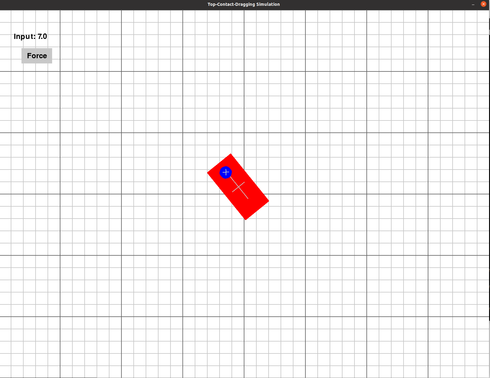

# 2D Planar Object sliding with Top-Contact Force Simulator
해당 코드는 2D 평면상에 특정한 물체가 놓여져 있을 때, 이를 위에서 눌러 힘을 가한 후 물체와 로봇간의 마찰력을 이용해 특정 위치로 끌어오는 상황을 가정합니다.
Soft contact surface가 물체 상단에 존재한다고 가정할 때, contact surface가 가하는 힘과 속도에 따라 물체의 움직임이 다르게 나타나게 됩니다. 수학적 모델링을 통해 이를 유도하고 시뮬레이션을 구성하여 추후 끌기 조작 상 Trajectory Planning이나 Control과 같은 심화된 문제를 푸는 데 활용되었습니다. 시뮬레이션의 알고리즘은 해당 논문을 주로 참고하여 작성하였습니다.

> M. Mahdi Ghazaei Ardakani1 , Joao Bimbo1 and Domenico Prattichizzo. "Quasi-static analysis of planar sliding using friction patches" The International Journal of Robotics Research (2020), .

## 1. 요구사항
### Python 요구사항
해당 코드는 파이썬 가상환경을 통해 구현되었으며, 다음과 같은 파이썬 패키지 버전에서 실행되었습니다.
- `numpy==1.24.4`
- `pygame==2.6.1`
- `PyYAML==6.0.2`
- `scipy==1.10.1`
- `collision==1.2.2`
- `corgipath==0.1.0a1`
- `matplotlib==3.7.5`

## 2. 파라미터 설정
`config`폴더 상의 `config.yaml` 파일을 수정하여 시뮬레이션과 관련된 다양한 설정이 가능합니다.
#### 2.1 simulator param
- `fps`: 코드 실행 시 디스플레이가 1초에 몇번씩 업데이트 빈도를 설정합니다.
- `sim_step`: 각 프레임마다 시뮬레이션을 업데이트하는 time-step size를 설정합니다.

#### 2.2 dragger, pullee param
- `init_position`: 접촉면과 끌기 대상의 초기 위치를 설정합니다.
- `init_rotation`: 접촉면과 끌기 대상의 초기 각도를 설정합니다.
- `contact_force, contact_radius`: 접촉면의 반지름 크기와 물체에 가하는 힘을 설정합니다. (접촉면의 경우 원 형태)
- `unit_v_speed, unit_r_speed`: 사용자가 입력을 넣었을때 해당하는 접촉면의 속도와 회전 크기를 설정합니다.
- `WIDTH, HEIGHT`: 끌기 대상의 너비와 높이를 설정합니다. (물체의 경우 직사각형 형태)

#### 2.3 envirnoment param
- `weight`: 끌기 대상의 무게를 설정합니다.
- `mu1, mu2`: 바닥면과 물체, 물체와 접촉면 간의 마찰 계수 크기를 설정합니다. (mu1 < mu2)
- `c_p, delta`: 접촉면의 힘에 따른 바닥면의 Pressure distribution shift에 관여합니다. (논문 참고 필요)

## 4. 실행
가상환경 구축 및 패키지 설치
```bash
$ python3 -m venv .venv
$ source .venv/bin/activate
$ pip install -r requirements.txt
```
시뮬레이터 실행
```bash
cd ./scripts
python3 simul_run.py
```

#### 조작 방식
접촉면이 가하는 힘을 변경할 때 빼고는 모두 키보를 통해서 조작한다
- `Q, E` Button : 접촉면을 반시계, 시계 방향으로 unit_r_speed를 갖도록 한다.
- `W, A, S, D` Button : 접촉면을 전우좌후 방향으로 unit_v_speed를 갖도록 한다.

만약, 접촉힘 크기를 변화시키고 싶다면 숫자를 눌러 왼쪽 상단에 Input 값을 변화시킨뒤, Force 버튼을 누른다.
